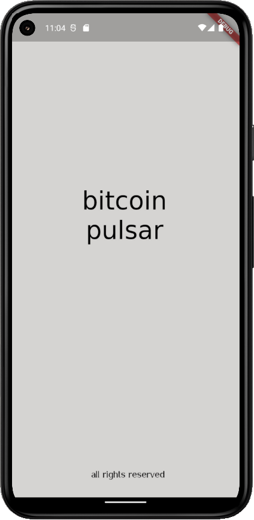
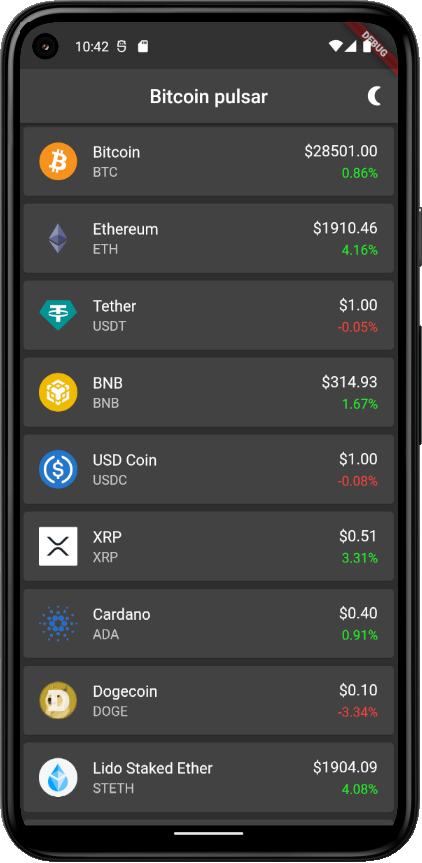
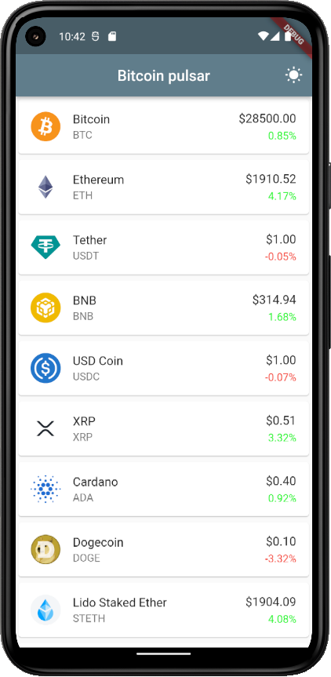
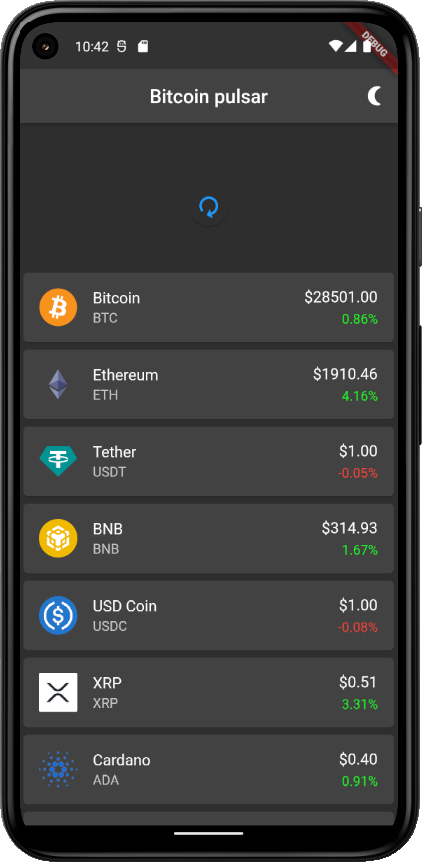
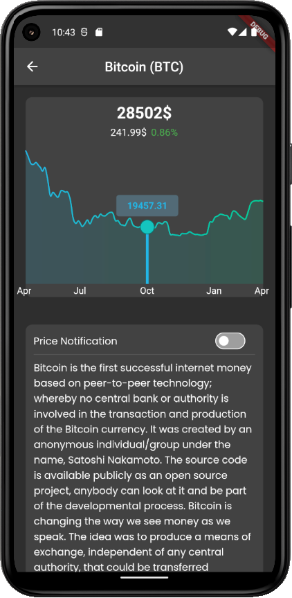
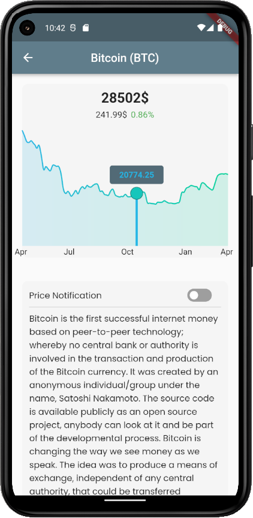

# Bitcoin Pulsar

### Cryptocurrency tracker.

In this app data provided by CoinGecko open API.

When starting app you can see spash screen

Then opens main screen with listview builder, where you can see first 20 tokens sorted by market capitilazition, with most userful information.
In this app implemented changind light and dark themes, and pagination - when scroll down to last last coin - downloading next 20 coins.

You can update information by pulldown action:

For more information and history price since last year - click on token. You can see chart (builded with **fl_chart**), and short description of coin, with deeplinks (used **url_launcher** and **flutter_likify**).

